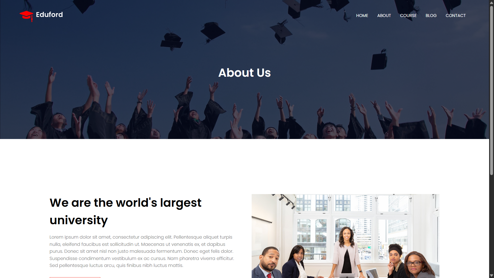

# 🎓 EdFord – University Website

Welcome to **EdFord**, a responsive and informative university website designed using **HTML** and **CSS** as part of an **O-Level Assignment**. This project showcases key sections of a university site, including Home, About, Courses, Blog, and Contact pages.

---

## 📸 Screenshots

### 🏠 Home Page

### ℹ️ About Page

### 📚 Courses Page

### 📝 Blog Page

### 📞 Contact Page

> 📁 Make sure all the above screenshots are placed in a `/screenshots` directory inside your project folder.

---

## 👨‍🎓 Developer Profile

**Shivam Maddheshiya** is a 22-year-old student who has completed his **B.Com** from *St. Andrew's College, Gorakhpur* in the year **2023**. He completed his schooling from **RPM Academy, Gorakhpur** affiliated with the **CBSE Board**.

---

## 🛠️ Technologies Used

- **HTML5**
- **CSS3**
- Responsive layout principles

---

## 🎯 Project Features

- Fully static, responsive front-end website
- Clean and professional UI for educational institutions
- Multiple sections: Home, About, Courses, Blog, Contact
- Smooth navigation for better user experience

---

## 📂 Project Structure

EdFord/
├── index.html
├── about.html
├── courses.html
├── blog.html
├── contact.html
├── style/
│ └── style.css
├── screenshots/
│ ├── home.png
│ ├── about.png
│ ├── courses.png
│ ├── blog.png
│ └── contact.png
└── profile/
└── shivam.jpg

---

## 📝 Note

This project is developed as a submission for the **O-Level Assignment** by **Shivam Maddheshiya**.

---

## 📬 Contact

For any queries, feel free to reach out to **Shivam Maddheshiya**.

